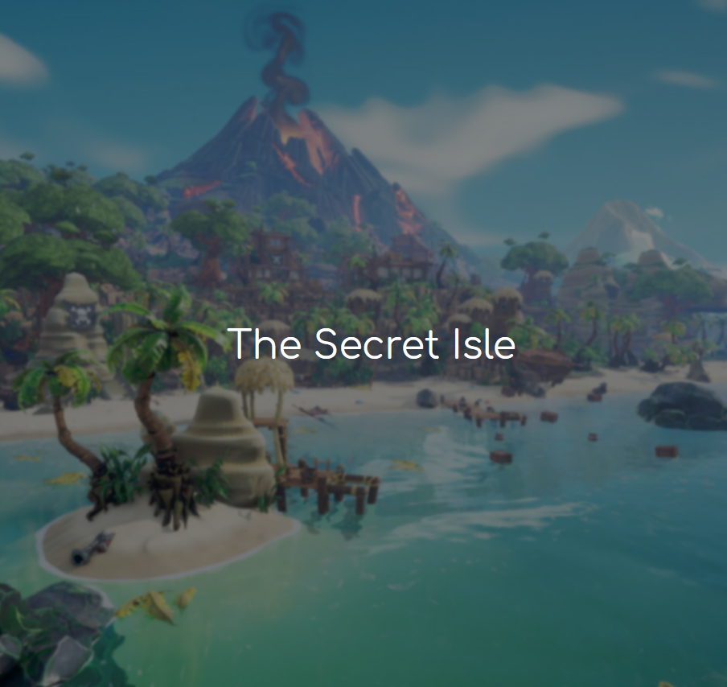

# TheSecretIsle

# Topic 
This application is an intuitive game that allows the user to progress through a story and make a decision based on the current situation at hand. As the user progresses through the game and makes decisions, the outcome is altered as metrics behind the scenes are being tracked based on the user's choices.

The current version of the application is a conceptual template for an organizational management tool.

The work environment is rapidly evolving. We need a new, improved, and easy way to train and develop teams from entry level positions to executive leadership.

## Table of Contents
* [Technologies Used](#technologies-used)
* [Setup](#setup)
* [Usage](#usage)
* [Future Development Outline](#future-development-outline)
* [License](#license)

## Technologies Used

Listed below are all of the technologies used in this repo:

- HTML
- CSS
- Javascript
- React 
- Node.js
- Express
- Express Session
- MongoDB
- Mongoose
- Axios
- bcrpyt
- Trivia Api
- Bootstrap - CSS Framework

## Setup
1. Open GitBash
2. You will need to clone to repository to your machine

  `$ git clone https://github.com/mqt2999/TheSecretIsle.git`
  
3. Then open the repository in your code editor of choice (ex: VSCode)

4. Then open the <i>Terminal</i> and run the following command to install all dependencies

  `$ npm i`
  
5. Then run this command to start the application

  `$ npm start`

## Usage
As a user, you will be able to login, sign and play The Secret Isle game. The game is a text based choose your own adventure game in which you make decisions based on a given scenario that affect the overall outcome of the game. 

Screenshots of the application and deployed application below

<a href="https://sleepy-lowlands-61315.herokuapp.com/">Checkout the deployed application here</a>

## Future Development Outline
The goal of this application is to be turned into an Organizational Management Tool. 

This application would allow team members to answer a series of questions in which responses are evaluated to measure seven key management and leadership areas. 

The results would provide a roadmap of interests and strengths to be used for evaluation, development, and coaching of the individual with a clear focus on specific objectives. 
 
These results can then be aggregated across a team or organization to evaluate corporate culture, assess their corporate strengths, as well as potential areas of development for the team or organization.  

### 7 Key Metric Areas:

- Time Management
- Interpersonal Skills
- Communication Skills
- Decision Making
- Teamwork
- Critical Thinking

Because these (7) key areas are being evaluated, this also allows leadership to pursue applicable further assessments  and improvements by choosing specific disciplines, or areas of skills-based training for a greater and more precise impact on team effectiveness and cooperation. 

This  with data-driven evaluation, and subsequent focus on common language, values, and corporate culture has significant potential to result in higher team satisfaction, longer terms of retention, and greater productivity.

With the rapidly changing work environment we are currently experiencing during and post-pandemic, it is imperative we begin new initiatives to help grow and develop the current workplace and corporate world.

## License
MIT License

Copyright (c) [2021] 

Permission is hereby granted, free of charge, to any person obtaining a copy
of this software and associated documentation files (the "Software"), to deal
in the Software without restriction, including without limitation the rights
to use, copy, modify, merge, publish, distribute, sublicense, and/or sell
copies of the Software, and to permit persons to whom the Software is
furnished to do so, subject to the following conditions:

The above copyright notice and this permission notice shall be included in all
copies or substantial portions of the Software.

THE SOFTWARE IS PROVIDED "AS IS", WITHOUT WARRANTY OF ANY KIND, EXPRESS OR
IMPLIED, INCLUDING BUT NOT LIMITED TO THE WARRANTIES OF MERCHANTABILITY,
FITNESS FOR A PARTICULAR PURPOSE AND NONINFRINGEMENT. IN NO EVENT SHALL THE
AUTHORS OR COPYRIGHT HOLDERS BE LIABLE FOR ANY CLAIM, DAMAGES OR OTHER
LIABILITY, WHETHER IN AN ACTION OF CONTRACT, TORT OR OTHERWISE, ARISING FROM,
OUT OF OR IN CONNECTION WITH THE SOFTWARE OR THE USE OR OTHER DEALINGS IN THE
SOFTWARE.
